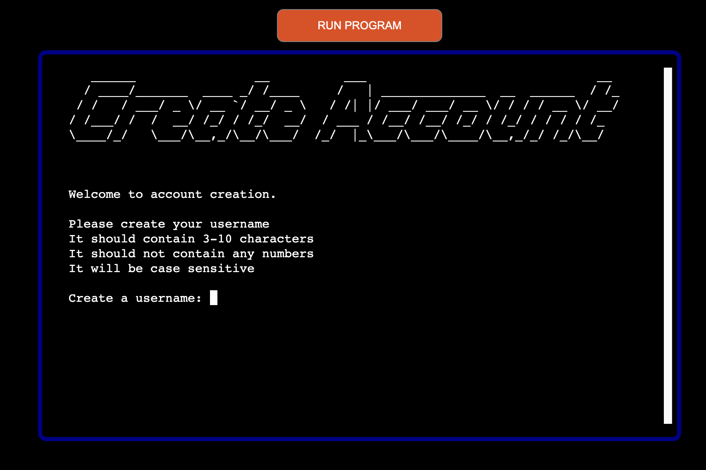
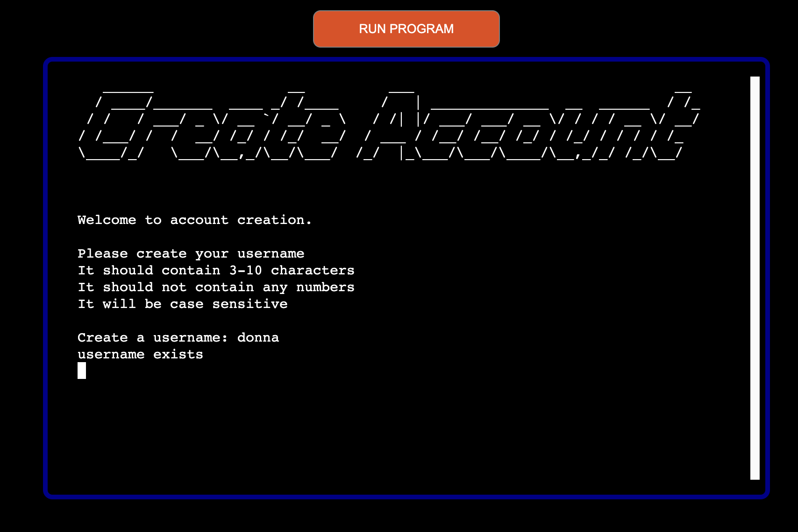
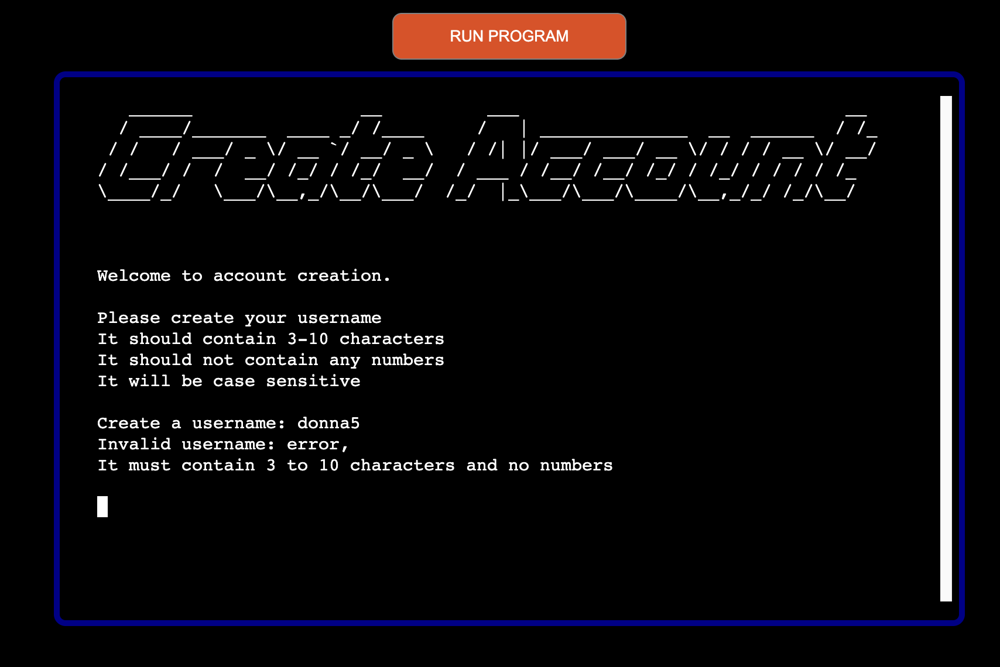
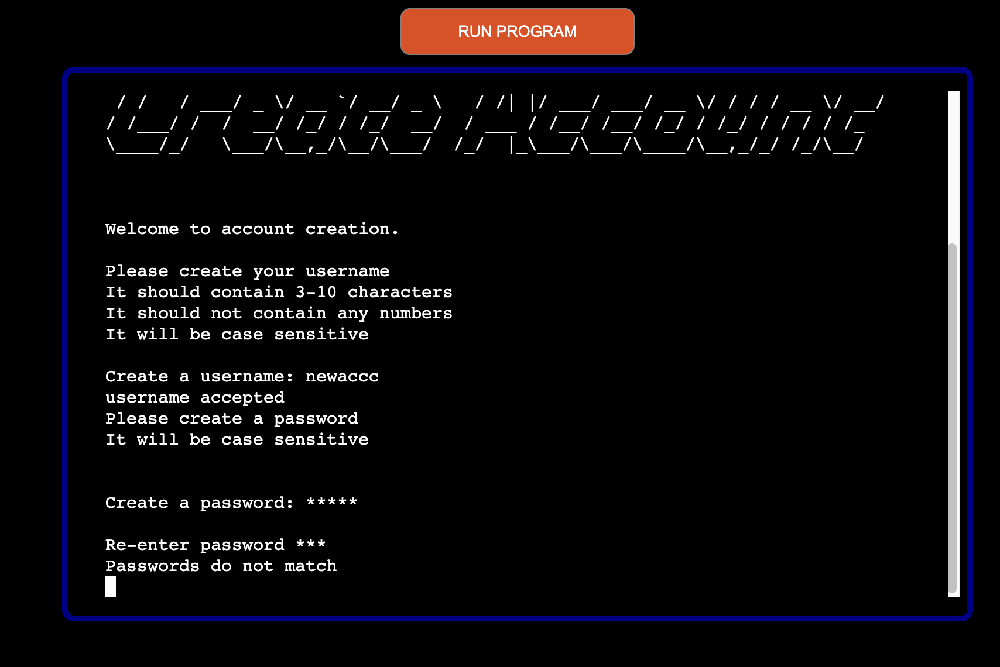
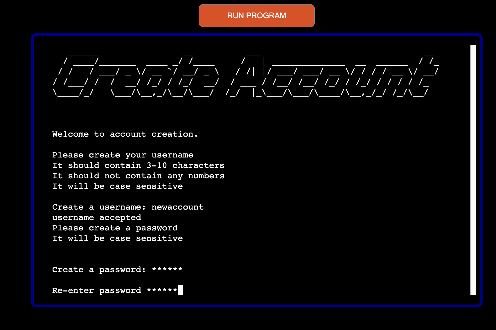
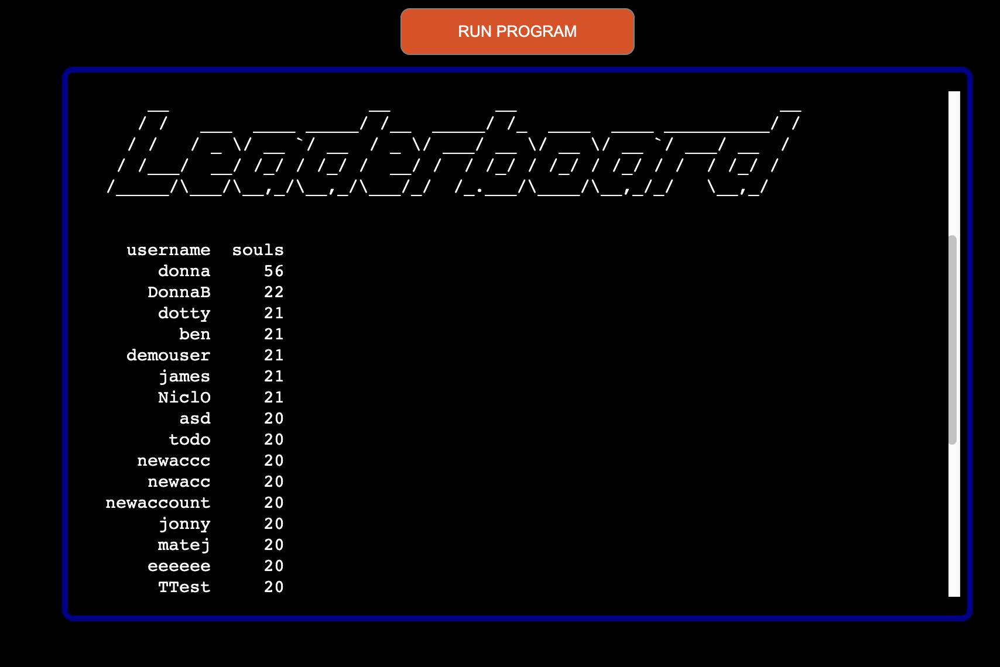

# SoulRoll

(Developer: Martin Bradbury)

## Live Website

Link to live website: [SoulRoll](https://soulroll-5cad4e0173ff.herokuapp.com/)

## Project purpose

LichKing is a Python terminal project game. The game is a story driven random number game where the player competes against the computer, the Lich King. The aim of the game is to reclaim lost souls the Lich King has taken. To do this you need to Lich King to roll the number 1 before you do. The game features a create account feature that stores the users details on google sheets, a login feature which pulls the users data from google sheets and a leaderboard, which displays all the users and their current souls. The game is interactive and provides feedback to the user throughout. All user input has validation functionality and the user can seamlessly play again or return to the main menu. 

## Table of Contense
1.  [Rules of the Game](#rules-of-the-game)
2.  [User Experience](#user-experience-ux)
    -   [Key Project Goals](#key-project-goals)
    -   [User Requirements and expectations](#user-requirements-and-expectations)
    -   [User Stories](#user-stories)
3.  [Features](#features)
    -   [Start Screen](#start-screen)

4.  [Furure Features](#future-features)

5.  [Design Features](#design-features)
    -   [Design Choice](#design-choices)
    -   [Typography](#typography)
    -   [Mock Terminal](#mock-terminal)
6.  [Flow Chart](#flow-chart)
7.  [Technology](#technology)
    -   [Language](#language)
    -   [Framework and Tools](#framweorks-and-tools)
    -   [Python Libraries and Modules](#python-libraries-and-modules)
8.  [Testing](#testing)
    -   [Code Validation](#code-validation)
    -   [PEP8 Validation](#pep8-validation)
    -   [Accessibility and Lighthouse](#accessibility-and-lighthouse)
    -   [Manual Testing](#manual-testing)
    -   [Browser Compatability](#browser-compatability-testing)
9.  [Bugs](#bugs)
    -   [Fixed Bugs](#fixed-bugs)
        -  [Username and Password](#username-and-password)
        -  [Stored Enter Presses](#stored-enter-presses)
        -  [Castle Image](#castle-image)
    -   [Known Bugs](#known-bugs)
        -  [Storing Keypress](#storing-keypress)
        -  [Print Statements](#print-statements)
10. [Deployment](#deployment)
    -   [Heroku](#how-this-site-was-deployed-to-heroku)
11. [Credits](#credits)

## Rules of the Game

    • You will take it in turn to roll a random number between 1 and 100.
    • Each roll after that will be between 1 and the number you last rolled.
    • The aim of the game is to NOT roll number 1.
    • Should you beat the Lich King you will be rewarded one soul.
    • Should you be defeated, you will lose a soul to the Lich King.
    • All new accounts start with 20 souls.

## User Experience (UX)

### Key Project Goals

    • To write and develop a Python terminal game that is interactive.
    • The game should be easy to follow and the interface should be easy to navigate.
    • The user should be able to restart, exit or continue playing after logging in.
    • The user will feel part of the story being told.
    • The user will need to create an account username and password which will be stored on google sheets.
    • There will be validation when creating the username and password.
    • A login feature that requires the user to type back in their username and password stored on google sheets.
    • A leaderboard feature which displays the users who have played and their souls remaining.
    • Users can log back into their account at any time to continue playing.

### User Requirements and Expectations

    • A clear and easy to read interface.
    • Clear and intuitive navigation options.
    • Be able to create a unique username that cannot be copied.
    • Be able to create a unique password that is encoded so cannot be seen on google sheets.
    • Be able to look at a leaderboard to see who has the most souls.
    • Have feedback throughout the game of how many souls they have.
    • Have imersion in the story of the game.
    • Be able to take time to read and understand the rules of the game. 
    • Have the opportunity to play again without going back to the main menu. 
    • Be able to exit back to the main menu at the end of a game.

## User Stories

As a site visitor,

    • I want to see the game title when I arrive on the start screen.
    • I want to be able to see the navigation of the game.
    • I want to be able to create a unique username and password.
    • I want to be able to login with my username and password.
    • I want to understand the story of the game.
    • I want to know the rules of the game.
    • I want to be able to play many times without returning to the main menu.
    • I want to know how many souls I have left and if I have won or lost each game. 
    • I want to be able to exit to the main menu and stop points in the game.
    • I want to be able to see my score and username on the leaderboard.

## Features

### Start Screen
The home screen will display the ASCII art heading 'SoulRoll' along with the options that can be selected. Each option is numbered for ease of selection. Validation will occur on selection to check the user has typed a valid number. If no valid number is used then a message appears stating invalid selection, please try again. 

#### Home screen image

### Login
If the user selects option one 'login' they will be presented with a screen that asks the user to type in their username and then password. This information is stored on google sheets. When the user types in their username and password a query is sent to google sheets to check if that username and password exists. If a match is found then will progress to a screen which will inform them how many souls they currently have. This information is retrieved from google sheet data for that username and password. If the login data is not correct, they will be informed that no match was found and they will be asked to reinput their username and password again. To porvent the user being stuck in an endless loop here, when they are informed that their usernamer and password is incorrect, they will alse be informed that if they type exit as the username and nothing in the password, they will return to the main menu. All password data stored on google sheets is encripted using hashlib which means that no sensitive data is visible on the google sheets. 

#### Login image

#### Login Success
If the user correctly inputs their username and password they will be presented with login success and then a clear screen which displays how many souls they currently have.

#### Login Success image and souls

#### Failed Login

#### Encripted Password data on google sheets

### Create Account

This option allows new users to create an account. Both the username and password undergo validation to ensure it meets the required conditions. 

#### Username
The username needs to be unique. After submitting a username google sheets is checked to ensure no other username exists that is the same. If a username exits that is the same, they will recieve a message saying that username already exists, please try another. The username also needs to be between 3 and 10 characters. If it does not meet this creteria they will be informed that in needs to fall within this range. Finally the username cannot contain any numbers. If a number is present anywhere in the username they will be informed that it must not contain any numbers. If all validation is passed, they will be informed that the username has been accepted. 

#### Username Creation

#### Username Exists

#### Username Too long / short

#### Username contains numbers

### Password Creation
The user is then asked to create a password. The password is case sensitive but can contain numbers, letters and any special characters. When the user is typing in their password it is hidden by stars using the maskpass feature. The user is able to see they they are typing characters as they input their password as a star appears for every character inputted. The ensure they user has not made a typing mistake, they have to input the password again to validate they are the same. If it is the same the user will be informed that the account was created successfully and return to the main screen. If it is not correct, they will be informed that passwords do not match and the create account function relaunches.

#### Passwords do not match

#### Passwords match

### Leaderboard
The leaderboard feature is selected from the home screen. It does not require the user to be logged in. Once slected the user will see a list of username and their current souls. This information pulled from data on google sheets. I used the pandas dataframe feature to display this leaderboard and ordered it with the users having the most souls at the top, down to the least at the bottom. I also selected the specific coulmns i wanted to show on the leaderboard as I did did not want to display the encripted password column no the index number.

#### Leaderboard

### The Story
The game is designed to be part of a story. The user, 'the champion' is tasked with facing down the Lich King and trying to take back the souls he has stolen. Rather than the story appearing instantly all in one go, i added a feature so the story is printed character by character across the screen. This gives the user the impression that this story is being told to them as they read along. I also added sleep functions at different points as the story is being printed to give the user chance to finish reading the section and to add suspense. The whole story fits on one screen and you do not progress to the game rules until ready. Before the story begins the game name is displayed to the user, before disapearing and a ASCII castle image I created appears. The story text scrolls below the castle image. To progress to the rules after the story you have to type the letter y. Validation occurs to ensure they user typed the letter y. If they do, they progress to the rules, if not, they are informed that they must select y or n. If n is selected they are returned to the main screen.

#### Game name

#### Castle

#### Story Text

#### Continue to Rules

### The Rules
This section informs the user how they are going to play the game. It details, how the game is won and lost and how the game works. Once users have read the rules they can select y to start the game or n to return back to the main menu. Their selection is validated to eusure either y or n is selected. 

#### The rules

### The Game - SoulRoll
After accepting the rules the users will be asked to type roll to start the game. Once they type roll a message is printed saying rolling and a random number appears in the terminal that they rolled. This random number is generated at random between 2 and 100. The reason it is between 2 and 100 is that the user nor the lick king loses on their first roll. Appearing after the users roll will be another print statement saying that the Lich King is rolling. Their number will appear below. The user will be asked to press enter to roll again. This time the random number generated will be between 1 and the last number they rolled. The same creteria for the Lich King roll. This process continues until either the user or the Lich King rolls the number 1 and loses. One the game ends the user will be informed of how many souls they now have. If they win they gain one soul, if they lose the lose one soul. This information is updated to google sheets and stored for that user. The user can continue to play as many times as they like by selecting y to play again. If they do not what to play again they can select n and return to the main menu.

#### Roll to begin

#### Random number fist roll

#### Random number second roll

#### Lich King Won

#### Player Won

## Future Features

### Gamble Souls
I would like to add a feature when the user can gamble any number of souls they currently have. This feature should check how many souls the user has and only allow them to gamble upto the total the posess. This would be very risky however because if they lost they would lose all those souls, but if they win, they would take that many souls from the Lich King.

### More games
I would like to develop more games for this story setting. Hangman, battle ships etc could be adapted to be inline with the story setting of this game. Users would be able to play different games on their login and their scores for the different cames could be saved on google sheets. 

## Design Features

### Design Choices
I decided to add the dark blue colour around the mock terminal to link to the story being told. The Lich King lives in icy mountais and is pure evil, the dark blue colour helps to tell that story along with the black background for contrast

### Mock Terminal
I decided to adjust the position of the mock terminal so that it sat in the center of the screen. I think this is more applealing for the user. The size of the teminal was unchanged.

## Technology

### Language

- Python

### Framweorks and Tools

- [Heroku](https://www.heroku.com/)
- [GitHub](https://github.com/)
- [CodeAnywhere](https://app.codeanywhere.com/)
- [Chrome DevTools](https://developer.chrome.com/docs/devtools/)
- [Google Lighthouse](https://chrome.google.com/webstore/detail/lighthouse/blipmdconlkpinefehnmjammfjpmpbjk)
- Code institute's template for the mock terminal was used, but it was styled by centering it and giving it a blue and black theme.
- Code Institutes Python Linter was used to check the Pythn code for errors.

### Python Libraries and Modules

- [google.oauth2.service_account](https://google-auth.readthedocs.io/en/master/reference/google.oauth2.service_account.html) was used to authorize the connection with the Google Sheets API. The Usernames, Passwords and souls were stored here.
- [gspread](https://docs.gspread.org/en/v5.11.3/) was imported and used to access and update data in the spreadsheet.
- [random](https://docs.python.org/3/library/random.html) was imported for generating random numbers.
- [pyfiglet](https://pypi.org/project/pyfiglet/) was imported to render ascii art
- [sys](https://docs.python.org/3/library/sys.html) was imported to clear the terminal on different operating systems.
- [time](https://docs.python.org/3/library/time.html) was imported to allow sleep delays between prompts
- [hashlib](https://docs.python.org/3/library/hashlib.html) was imported to encript and decode the users password before writing to google sheets and when required for login.
- [maskpass](https://pypi.org/project/maskpass/) was used to hide the users input in the terminal when typing in the password.
- [pandas](https://pandas.pydata.org/docs/getting_started/install.html) was used to display the leaderboard in a dataframe.

## Testing

### Code Validation

#### PEP8 Validation

PEP8 is a style guide for Python Code

The results were all clear with no errors found in run.py code through the CI Python Linter.

### Accessibility and Lighthouse

colour scheme for accesibility score and value.

### Manual Testing

#### Browser Compatability Testing

- The app was tested on the following broswers: Chrmose, Edge, Safari.
- The app worked as intended on all browsers tested.

## Bugs

### Fixed Bugs

#### Username and Password
The username and password was not accepted even when inputted corectly. This bug was fixed by removing the .lower() on the input method so that the username and password became case sensetive. I informed the user when creating the account that the username and password are case sensetive. 

#### Stored Enter Presses
Pressing enter gets stored when the print statements are being displayed. When the input prompt appears and askes you to press enter to continue it skips it due to the stored enter key press before the user gets chance to ready what is shown. This also skipped through the rules section of the game. I fixed this buy by changing some of the continue prompts from enter to a required key press y/n.

#### Castle Image
The castle image was not displaying correctly so I removed some of the height from the design. The castle now displays correctly in the terminal. It also through effors in the CI linter so I changed the string to an r string.

### Known Bugs

#### Storing Keypress
Although I overcame the stored enter key press skipping content by adding a required key press y/n, during the random number generation aspect of the game it will skip through rolls quickly if the user presses enter before prompted. I would like to investigate a way to disable any key press until the prompt is displayed. 

#### Print statements
When the story element of the game prints letter by letter, if the user presses any key it inputs the key press in the print statement. Enter will drop a line as the print statement is getting printed to the terminal. I would like to research a way to restruct any key press while the story is being printed to the terminal. 

## Deployment

All the code written for this project was written in CodeAnywhere. GitHub was used for version control and the application was deployed to Heroku from Github.

### How this site was deployed to heroku

After account setup, the steps were as follows:

- Click the "create new app" button on heroku
- Create a unique name for the app
- Select region, Europe was selected for this project
- Click "create app"
- Go to settings tab
- Set config vars using the creds.json file. In the field for key, "CREDS" should be entered and in the field for value, the entire cred.json file content is entered
- Then click "add buildpack"
- Use python and nodejs buildpacks
- The buildpack order should be python on top and nodejs underneath
- Go to the deploy tab
- Select the deployment method, github was used for this project
- Search for the github repository name it was soulroll for this project
- Click connect
- There is an option to use manual deployment or automatic deployment. 
- For control of commits and updates, manual deployment was selected
- Make sure main branch is selected
- After the first deployment you will see a message saying "your app was successfully deployed" and there will be a "view" button to take you to your deployed application

The live link for this project can be found here - [SoulRoll](https://soulroll-5cad4e0173ff.herokuapp.com/)

## Credits

[Love sandwiches code institute walk through](https://github.com/Code-Institute-Solutions/love-sandwiches-p5-sourcecode/blob/master/05-deployment/01-deployment-part-1/run.py) - Code was adapted from the code institute love sandwiches project.

[Learning To Program in Python](https://www.amazon.co.uk/Learning-Program-Python-2017-Heathcote/dp/1910523119) - This book was used to help with my knowledge and provide ideas and exercises to implement my code. 

time
maskpass
hashlib

mentor

